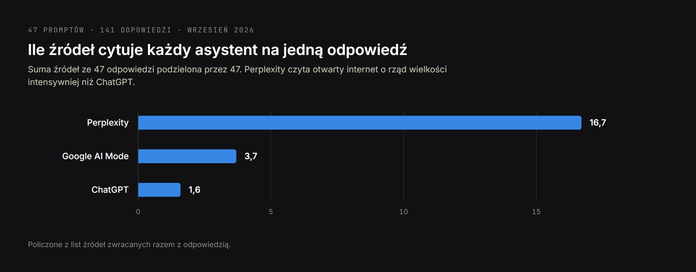
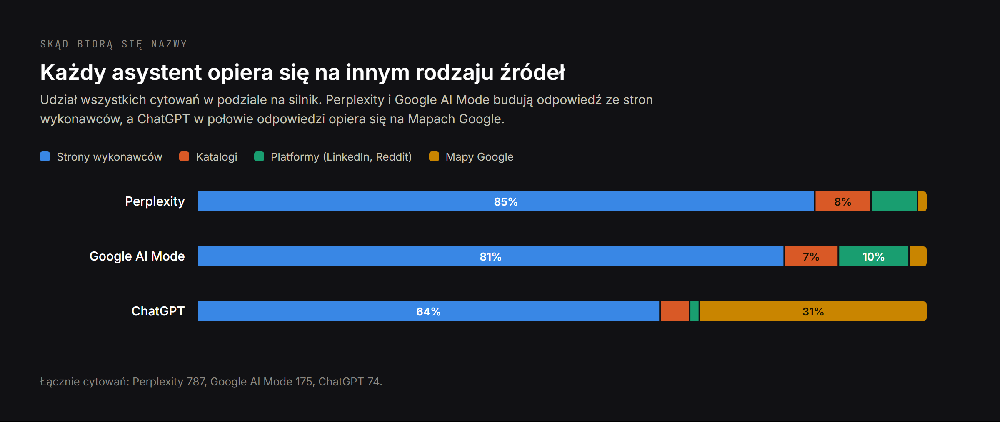
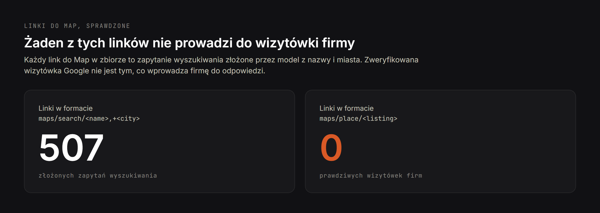
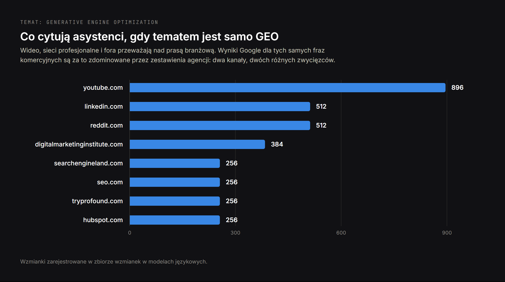

# Co odpowiadają asystenci AI zapytani, kogo zatrudnić: analiza 141 odpowiedzi

**Szkic, 13 września 2026. Nieopublikowane.**

Proponowany slug: `pozycjonowanie-w-ai-badanie`
Meta title: `Pozycjonowanie w AI: badanie 141 odpowiedzi asystentów`
Meta description: `47 promptów, trzej asystenci, 141 odpowiedzi. Kogo wymieniają
ChatGPT, Perplexity i Google AI Mode na pytanie, kogo zatrudnić, i skąd każdy
z nich bierze źródła.`

**Fraza docelowa:** `pozycjonowanie w AI` — 260 wyszukiwań miesięcznie w
Polsce, sprawdzone w danych, nie założone. To jedyna fraza w tym temacie z
mierzalnym popytem po polsku, więc niesie ją tytuł i trzy podtytuły.

---

Prawie wszystko, co napisano o optymalizacji pod wyszukiwanie AI, opisuje
mechanizm, ale go nie mierzy. To jest pomiar: 47 pytań zakupowych, trzej
asystenci, 141 odpowiedzi, każde cytowanie policzone.

Wnioski poniżej dotyczą mechanizmów, nie procentów. Czterdzieści siedem
promptów wystarcza, by zobaczyć, jak te systemy działają, i nie wystarcza, by
liczyć przedziały ufności. Tam, gdzie liczba jest miękka, jest to powiedziane.

## Czym jest pozycjonowanie w AI i co dokładnie zmierzono

Generative engine optimization, w skrócie GEO, a po polsku najczęściej
pozycjonowanie w AI, to praca nad tym, żeby firma została wymieniona wewnątrz
odpowiedzi napisanej przez asystenta, a nie na liście niebieskich linków.
Terminy pokrewne — LLM SEO, answer engine optimization, widoczność w AI —
opisują to samo zadanie z różnych stron.

Pytanie tego badania jest węższe i łatwiejsze do sprawdzenia niż „jak robić
GEO". Brzmi ono: **kiedy kupujący opisuje asystentowi swoją sytuację i pyta,
kogo zatrudnić, których wykonawców asystent wymienia i skąd bierze te nazwy?**

Druga połowa tego pytania jest niemal nigdzie nie publikowana i okazała się
ważniejsza od pierwszej.

## Jak przeprowadzono badanie

Czterdzieści siedem promptów napisanych tak, jak ludzie mówią do asystenta, a
nie tak, jak wpisują w wyszukiwarkę. Nie „tworzenie stron Warszawa", tylko
„Prowadzę małą kancelarię prawną w Warszawie i potrzebuję wielojęzycznej
strony, która dodatkowo będzie widoczna w Google. Do jakiego programisty albo
małej agencji się zwrócić?"

Osiem bloków:

| Blok | Promptów | Przykładowa intencja |
|---|---:|---|
| Tworzenie stron według branży | 10 | psycholog, kancelaria, stomatologia, deweloper |
| Tworzenie stron według zadania | 6 | wielojęzyczność, headless CMS, migracja platformy |
| SEO | 8 | audyt techniczny, SEO międzynarodowe, spadek ruchu |
| Programista i SEO w jednej osobie | 5 | jeden wykonawca do obu zadań |
| Widoczność w AI | 5 | błędne dane w ChatGPT, utrzymanie encji |
| Geografia | 4 | Warszawa, Cypr, praca zdalna w Europie |
| Język rosyjski | 5 | te same intencje, rosyjskie sformułowania |
| Język polski | 4 | te same intencje, polskie sformułowania |

Każdy prompt wprost prosił o nazwy. Bez tego asystent odpowiada poradami
zamiast krótką listą, a to niczego nie mierzy.

| Silnik | Konfiguracja |
|---|---|
| Google AI Mode | żywe API wyników wyszukiwania, lokalizacja krajowa |
| Perplexity | model sonar, wyszukiwanie w sieci włączone |
| ChatGPT | gpt-4.1-mini przez API, wyszukiwanie w sieci włączone |

Całkowity koszt przebiegu: około półtora dolara. Metoda jest odtwarzalna dla
dowolnej domeny i opisana krok po kroku w osobnym tekście o tym,
[jak sprawdzić, co AI mówi o Twojej firmie](/pl/blog/co-asystenci-ai-mowia-o-twojej-firmie).

## Ile źródeł cytuje każdy asystent na jedną odpowiedź

Asystenci nie zwracają dziesięciu linków. Zwracają krótką listę, a ilość
dowodów za tą listą różni się o rząd wielkości.

| Silnik | Cytowań łącznie na 47 odpowiedzi | Na jedną odpowiedź |
|---|---:|---:|
| Perplexity | 787 | 16,7 |
| Google AI Mode | 175 | 3,7 |
| ChatGPT | 74 | 1,6 |

Zmienia się kształt, nie stopień. Wyniki wyszukiwania mają pierwszą stronę,
drugą i trzecią. W odpowiedzi mieści się kilka nazw i nie ma tam strony drugiej:
firma albo jest na liście, albo dla tego pytania nie istnieje.

Ten rozrzut wyznacza też, na ile strona internetowa może w ogóle wpłynąć na
dany silnik. Perplexity czyta na tyle szeroko, że dobrze napisana strona ma
gdzie zostać znaleziona. ChatGPT przy 1,6 cytowania na odpowiedź wybiera ze
znacznie węższego zbioru, a wybór następuje zanim strona zostanie przeczytana.

## Skąd każdy asystent bierze źródła: ChatGPT, Perplexity i Google AI Mode

To jest ustalenie o największej wadze praktycznej i powód, dla którego
pozycjonowanie w AI nie jest jedną pracą.

Każde cytowanie we wszystkich 141 odpowiedziach przypisano do jednej z czterech
kategorii: własna strona wykonawcy, katalog w rodzaju Clutch albo Sortlist,
platforma w rodzaju LinkedIn albo Reddit, oraz Mapy Google.

| Silnik | Strony wykonawców | Katalogi | Platformy | Mapy Google | Odpowiedzi z Mapami |
|---|---:|---:|---:|---:|---:|
| Perplexity | 667 | 61 | 50 | 9 | 7 z 47 |
| Google AI Mode | 141 | 13 | 17 | 4 | 4 z 47 |
| ChatGPT | 47 | 3 | 1 | 23 | 23 z 47 |

Perplexity zacytowało strony wykonawców 667 razy, mniej więcej czternaście razy
na odpowiedź. Realnie chodzi po sieci i pokazuje, co przeczytało.

ChatGPT zacytował strony wykonawców 47 razy na 47 odpowiedzi — niemal dokładnie
raz na odpowiedź — i w połowie przypadków sięgnął po Mapy Google.

Google AI Mode cytuje najmniej, około trzech źródeł na odpowiedź, z najostrzejszą
selekcją.

**Trzy silniki, trzy różne nawyki czytania.** Praca, dzięki której cytuje Cię
Perplexity, to praca nad stroną. Praca, dzięki której wymienia Cię ChatGPT, w
większości nie jest na stronie. Każda usługa sprzedawana jako „wyszukiwanie AI"
w całości uśrednia trzy różne problemy.

## Dlaczego linki ChatGPT do Map Google nie są wizytówkami firm

Połowa odpowiedzi ChatGPT z linkami do Map podsuwa oczywisty wniosek:
zweryfikowana wizytówka Google musi być biletem wstępu do widoczności w AI.
Forma linku ten wniosek obala.

| Forma linku | Ile w zbiorze | Co to jest |
|---|---:|---|
| `google.com/maps/search/<nazwa>,+<miasto>` | 507 | złożone zapytanie wyszukiwania |
| `google.com/maps/place/<wizytówka>` | 0 | prawdziwa wizytówka |

Każdy link do Map to zapytanie, które model złożył z nazwy i miasta. Żaden nie
prowadzi do realnej wizytówki.

ChatGPT znajduje wykonawców zwykłym wyszukiwaniem w sieci, a link do Map dorysowuje
obok nazwy jako wygodny przycisk dla czytelnika. To, czy firma ma zweryfikowaną
wizytówkę, nie wchodzi do selekcji.

Wizytówka Google nadal jest warta posiadania dla pakietu lokalnego i dla ludzi
szukających po mapach. Nie jest jednak mechanizmem, który wprowadza firmę do
odpowiedzi AI, a twierdzenie przeciwne sprawdza się po kształcie adresu w około
minutę.

## LLM SEO kontra klasyczne SEO: dwa kanały nagradzają co innego

Kiedy tematem staje się samo GEO, asystenci cytują to:

| Źródło | Wzmianek |
|---|---:|
| youtube.com | 896 |
| linkedin.com | 512 |
| reddit.com | 512 |
| digitalmarketinginstitute.com | 384 |
| searchengineland.com | 256 |
| seo.com | 256 |
| tryprofound.com | 256 |
| hubspot.com | 256 |

Wyniki Google dla tych samych fraz komercyjnych wyglądają zupełnie inaczej. Tam
pierwsza strona to mniej więcej w połowie strony ofertowe agencji, a w połowie
zestawienia: „8 najlepszych agencji GEO dla marek B2B SaaS", „10 najlepszych
agencji generative engine optimization", „Najlepsza agencja LLM SEO: sprawdziliśmy 22".

| Kanał | Co wygrywa | Co z tym zrobić |
|---|---|---|
| Organiczne Google | zestawienia i strony ofertowe agencji | trafiać do zestawień |
| Odpowiedzi asystentów | wideo, sieci profesjonalne, fora, duże wydawnictwa | być tam, gdzie te źródła powstają |

Dwa kanały, dwa różne zestawy zwycięzców, a wysiłek w jednym nie przenosi się na
drugi. To najdroższe nieporozumienie w tej dziedzinie.

## Jakich wykonawców wymienia się przy pozycjonowaniu w AI

Nazwy firm nie są publikowane: to badanie mechanizmu, a nie ranking, a krótka
lista zbudowana na 47 promptach przeceniałaby to, co próbka pozwala twierdzić.
Ustaleniem jest wzorzec.

| Typ promptu i rynek | Kogo wymieniali asystenci |
|---|---|
| Agencja GEO, Wielka Brytania | siedem niezależnych agencji średniej wielkości, u większości osobna strona ofertowa pod GEO, a nie sekcja wewnątrz ogólnej strony o SEO |
| Agencja GEO, Stany Zjednoczone | czterech wykonawców, przeciętnie więksi od brytyjskich i mocniej wyspecjalizowani w B2B |
| Utrzymanie encji i źródeł, Wielka Brytania | pięciu wykonawców, w tym dwóch specjalistów od reputacji i Wikipedii, a nie agencji SEO w ogóle |
| Programista Next.js z SEO, dowolny rynek | pojedyncze osoby z prywatnymi stronami, nie firmy |

Trzy rzeczy w tej tabeli są warte więcej niż jakakolwiek lista nazw.

**Osobna strona wygrywa z sekcją.** W zestawie brytyjskim wymienieni wykonawcy
niemal zawsze mieli stronę poświęconą w całości tej usłudze, o którą pytano. Ci,
u których ta sama usługa była sekcją wewnątrz ogólnej strony o SEO, w
odpowiedziach prawie się nie pojawiali — nawet gdy ogólna strona była mocniejsza.

**Jednego wykonawcę zacytowano przez wizytówkę w katalogu, a nie przez jego
stronę.** Do odpowiedzi trafiła nie strona główna, tylko profil w katalogu
branżowym. Jeśli w tym badaniu jest jedna powtarzalna taktyka, to właśnie ta.

**Przy promptach o programistę asystenci wymieniali ludzi, nie firmy.** Każdy z
prywatną stroną, a jeden ze stroną, której adres dosłownie powtarza nazwę
poszukiwanej usługi. W tej niszy bycie pojedynczym specjalistą nie jest wadą.
Wadą jest bycie nieczytelnym.

**Granica kategorii też się przesunęła.** Przy promptach o utrzymanie encji
dwóch z pięciu wymienionych okazało się specjalistami od reputacji i Wikipedii,
a nie agencjami wyszukiwarkowymi. Asystent, któremu zadano pytanie o źródła i
zapisy, nie ogranicza się do branży, która zwykle rości sobie prawo do tej frazy.

## Co sprawia, że asystent wymienia jednego wykonawcę zamiast drugiego

W najjaśniejszym przypadku Perplexity samo wyjaśniło swój wybór. Nazwa wykonawcy
jest ukryta, rozumowanie zacytowane dosłownie:

> Dla małej kancelarii prawnej w Warszawie, która potrzebuje wielojęzycznej
> strony z SEO, najlepszym dopasowaniem wśród wyników jest **[wykonawca]**:
> **wprost mówią**, że budują strony i prowadzą SEO dla firm w Warszawie,
> pracują po polsku, angielsku i rosyjsku oraz oferują wielojęzyczną stronę
> nastawioną na konwersję z optymalizacją pod wyszukiwanie i AI **zawartą w
> opisie pakietu**.

Model zestawił cztery podane fakty z czterema warunkami pytania: co to za praca,
dla kogo, w jakich językach, co jest w cenie. Nie oceniał jakości, nie oglądał
portfolio, nie czytał opinii. Kluczowa fraza to „wprost mówią".

Stąd zasada, którą warto sformułować bez ogródek. **Asystent poleca tę firmę,
której specjalizację maszyna potrafi odczytać bez domysłów.** Twierdzenia
wymagające interpretacji są dla tego procesu niewidzialne.

### Trafić do rozważanych i trafić do rekomendacji to dwa różne stany

W czterech kolejnych odpowiedziach asystent zacytował stronę wykonawcy jako
źródło i polecił kogoś innego. Strona okazała się wystarczająco dobra, by na
niej zbudować odpowiedź, i niewystarczająca, by zająć miejsce na liście.

Większość porad o widoczności w AI tych dwóch stanów nie rozróżnia, przez co
trudno je diagnozować. Bycie przeczytanym jest konieczne, ale niewystarczające.

### Rozmyta encja waży więcej niż jakość strony

Jeden wzorzec tłumaczy więcej porażek niż jakikolwiek czynnik na samej stronie.
Tam, gdzie nazwa wykonawcy pokrywa się z nazwiskami innych osób albo nazwami
innych firm, asystenci wymieniają konkurenta o jednoznacznej tożsamości.

Wyszukiwanie po nazwie, które zwraca mieszankę niepowiązanych osób, firmy z
innej branży i imiennika w wiadomościach, nie pozwala maszynie ustalić, o którą
encję chodzi. Przepisywanie stron ofertowych tego nie naprawia. Naprawia to
praca nad encją: jedna kanoniczna nazwa, węzeł `Person` albo `Organization` ze
stabilnym identyfikatorem, wszystkie profile wymienione w `sameAs` i ten sam
opis co do słowa na stronie, w katalogach i w profilach społecznościowych.

## Jak śledzić widoczność w AI dla własnej firmy

Opisany przebieg jest powtarzalny w cenie, która czyni comiesięczny monitoring
drobiazgiem.

| Krok | Szczegóły |
|---|---|
| Ustalić zestaw promptów | 20–50 sztuk, sformułowanych jak u kupującego, z prośbą o nazwy |
| Zamrozić sformułowania | zmiana promptów między przebiegami niszczy porównywalność |
| Uruchamiać silniki osobno | wyniki różnią się na tyle, że uśrednianie ukrywa sygnał |
| Zapisywać dwa stany | wymieniony w tekście oraz zacytowany tylko jako źródło |
| Logować źródła | z jakich domen zbudowano odpowiedź, nie tylko kto wygrał |
| Powtarzać co miesiąc | te same prompty, te same silniki, te same lokalizacje |

Metryką, która ma znaczenie, jest liczba odpowiedzi wymieniających firmę
względem zamrożonej bazy. Procentowe udziały głosu na małym zestawie promptów
skaczą z powodów niezwiązanych z firmą.

## Ograniczenia badania

**Konfiguracja asystenta to nie ta, z której korzystają ludzie.** Wyniki ChatGPT
pochodzą z gpt-4.1-mini przez API z wyszukiwaniem w sieci. Aplikacja
konsumencka to inny model, inny stos wyszukiwania, personalizacja i pamięć.
Wniosków z jednego nie przenosi się na drugie.

**To jedna migawka.** Odpowiedzi zależą od sformułowania, języka, sesji i czasu
i są stale składane od nowa. Nic tutaj nie jest stabilnym rankingiem.

**Wielkość próby.** Czterdzieści siedem promptów pokazuje kształt mechanizmów.
Na twierdzenia procentowe się nie nadaje i takich tu nie ma.

**Pokrycie językowe.** Dziewięć z 47 promptów było po rosyjsku i po polsku.
Wnioski angielskie opierają się na szerszej bazie niż pozostałe dwa języki.

## Pozycjonowanie w AI: lista kroków, którą te dane potwierdzają

1. Napisać prostymi zdaniami oznajmującymi, co firma robi, dla kogo, w jakich
   językach i co jest w cenie. Jedyna odpowiedź, która wyjaśniła swój wybór,
   zacytowała dokładnie to.
2. Rozwiązać rozmycie encji przed wszystkim innym. Jeśli wyszukiwarka nie
   odróżnia firmy od imienników, reszta nie ma znaczenia.
3. Wybrać, który asystent jest istotny dla danego kupującego, bo optymalizacja
   pod jeden nie jest optymalizacją pod drugi.
4. Trafiać do katalogów, które są realnie cytowane, a nie do tych, które po
   prostu przyjmują rejestracje.
5. Traktować wideo i sieci profesjonalne jako materiał źródłowy, a nie kanał
   dystrybucji, bo stamtąd pochodzą cytowania w tym temacie.
6. Mierzyć co miesiąc na zamrożonym zestawie promptów.

---

## Notatki do sprawdzenia

**Lokalizacja, nie tłumaczenie.** Struktura i dane wspólne z wersją angielską,
sformułowania napisane od nowa pod polskiego czytelnika.

**Fraza docelowa jest realna.** `pozycjonowanie w AI` ma 260 wyszukiwań
miesięcznie w Polsce według danych, nie według przypuszczenia. Niesie ją tytuł,
meta title i trzy podtytuły. To jedyna fraza w tym temacie po polsku z
mierzalnym popytem — pozostałe warianty, które sprawdzono, mają zero.

**Link do metody** prowadzi do `/pl/blog/co-asystenci-ai-mowia-o-twojej-firmie` —
przed publikacją sprawdzić, czy polska wersja tamtego tekstu istnieje i czy slug
się zgadza.

**Ilustracje** podstawione polskie, z katalogu `drafts/article-figures/`.
