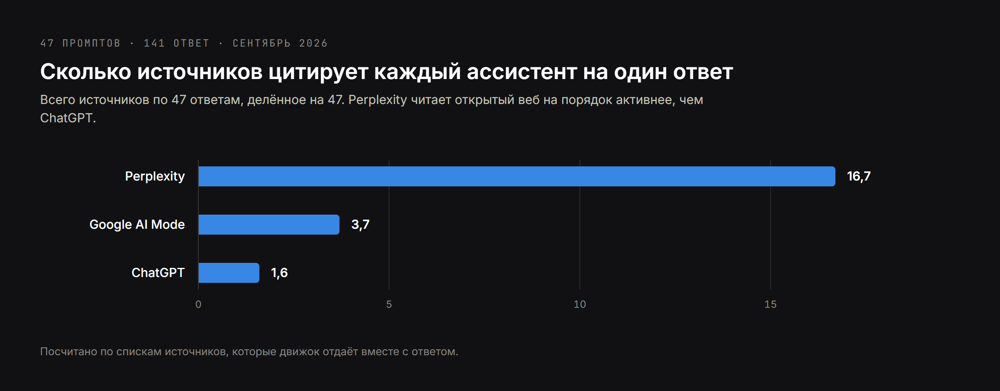
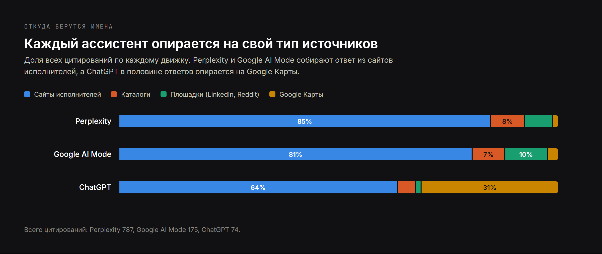
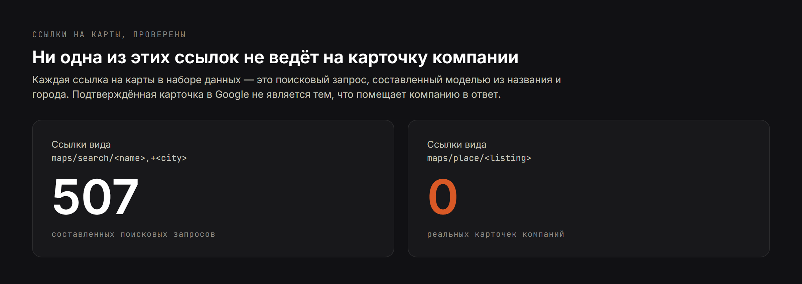
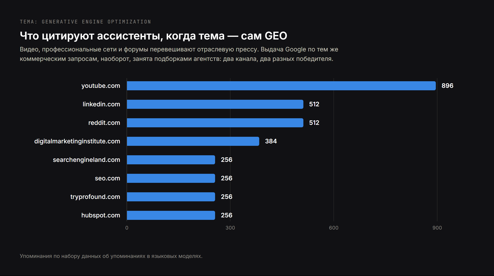

# Что отвечают ИИ-ассистенты на вопрос «кого нанять»: разбор 141 ответа

**Черновик, 13 сентября 2026. Не опубликовано.**

Предлагаемый слаг: `issledovanie-otvetov-ii-assistentov`
Meta title: `Кого называют ИИ-ассистенты: исследование 141 ответа`
Meta description: `47 промптов, три ассистента, 141 ответ. Кого называют
ChatGPT, Perplexity и Google AI Mode на вопрос «кого нанять» и откуда каждый
берёт источники.`

**Про частотность, честно.** По русскоязычным запросам этой темы измеримого
спроса нет: проверка через DataForSEO не вернула ни одного ключа с ненулевой
частотностью ни по одной затравке. Русская версия не привлечёт органику с
GEO-запросов, и рассчитывать на это не надо. Её смысл в другом: аудитория,
которая уже читает сайт по-русски, единство сущности между локалями и
материал, которым можно делиться. Английская версия — та, что работает на
поиск.

---

Почти всё, что пишут об оптимизации под ИИ-поиск, описывает механизм, но не
измеряет его. Это измерение: 47 покупательских вопросов, три ассистента, 141
ответ, каждое цитирование посчитано.

Выводы ниже — про механизмы, а не про проценты. Сорока семи промптов хватает,
чтобы увидеть, как эти системы устроены, и не хватает, чтобы строить
доверительные интервалы. Где цифра мягкая, об этом сказано.

## Что такое GEO-оптимизация и что именно здесь измерялось

Generative engine optimization, сокращённо GEO, — это работа над тем, чтобы
бизнес назвали внутри ответа, написанного ИИ-ассистентом, а не в списке синих
ссылок. Смежные термины — LLM SEO, answer engine optimization, видимость в ИИ —
описывают ту же задачу с разных сторон.

Вопрос этого исследования уже и проверяемее, чем «как делать GEO». Он звучит
так: **когда покупатель описывает ассистенту свою ситуацию и спрашивает, кого
нанять, каких исполнителей тот называет и откуда он берёт эти имена?**

Вторая половина вопроса почти никем не публикуется, и она оказалась важнее
первой.

## Как проводилось исследование

Сорок семь промптов, написанных так, как люди говорят с ассистентом, а не так,
как набирают в поисковой строке. Не «разработка сайтов Варшава», а «У меня
небольшая юридическая фирма в Варшаве, нужен многоязычный сайт, который ещё и
ранжируется в Google. К какому разработчику или небольшому агентству
обратиться?»

Восемь блоков:

| Блок | Промптов | Примеры интента |
|---|---:|---|
| Разработка под отрасль | 10 | психолог, юрфирма, стоматология, застройщик |
| Разработка под задачу | 6 | многоязычность, headless CMS, переезд платформы |
| SEO | 8 | техаудит, международное SEO, падение трафика |
| Разработчик и SEO в одном лице | 5 | один исполнитель на обе задачи |
| Видимость в ИИ | 5 | неверные данные в ChatGPT, поддержка сущности |
| География | 4 | Варшава, Кипр, удалённая работа по Европе |
| Русский язык | 5 | те же интенты, русские формулировки |
| Польский язык | 4 | те же интенты, польские формулировки |

Каждый промпт прямо просил назвать имена. Без этой просьбы ассистент отвечает
советами вместо списка исполнителей, а это ничего не измеряет.

| Движок | Конфигурация |
|---|---|
| Google AI Mode | живой SERP API, локация по стране |
| Perplexity | модель sonar, веб-поиск включён |
| ChatGPT | gpt-4.1-mini через API, веб-поиск включён |

Полная стоимость прогона — около полутора долларов. Метод воспроизводим для
любого домена и описан по шагам в отдельной статье про то,
[как проверить, что ИИ говорит о вашей компании](/ru/blog/chto-ii-assistenty-govoryat-o-vashey-kompanii).

## Сколько источников цитирует каждый ассистент на один ответ

Ассистенты не отдают десять ссылок. Они отдают короткий список, и объём
доказательств за этим списком различается на порядок.

| Движок | Всего цитирований на 47 ответов | На один ответ |
|---|---:|---:|
| Perplexity | 787 | 16,7 |
| Google AI Mode | 175 | 3,7 |
| ChatGPT | 74 | 1,6 |

Меняется не степень, а форма. У выдачи есть первая страница, вторая и третья.
В ответе помещается несколько имён, и второй страницы там нет: бизнес либо в
списке, либо не существует для этого вопроса.

Разброс задаёт и то, насколько сайт вообще способен повлиять на каждый движок.
Perplexity читает достаточно широко, чтобы хорошо написанной странице было где
найтись. ChatGPT с его 1,6 цитирования на ответ выбирает из гораздо более
узкого набора, и отбор происходит до того, как страница прочитана.

## Откуда каждый ассистент берёт источники: ChatGPT, Perplexity и Google AI Mode

Это находка с наибольшим практическим весом, и именно из-за неё «оптимизация
под ИИ-поиск» — не одна работа.

Каждое цитирование во всех 141 ответе отнесено к одной из четырёх категорий:
сайт самого исполнителя, каталог вроде Clutch или Sortlist, площадка вроде
LinkedIn или Reddit, и Google Карты.

| Движок | Сайты исполнителей | Каталоги | Площадки | Google Карты | Ответов с картами |
|---|---:|---:|---:|---:|---:|
| Perplexity | 667 | 61 | 50 | 9 | 7 из 47 |
| Google AI Mode | 141 | 13 | 17 | 4 | 4 из 47 |
| ChatGPT | 47 | 3 | 1 | 23 | 23 из 47 |

Perplexity сослался на сайты исполнителей 667 раз, примерно четырнадцать раз на
ответ. Он реально ходит по вебу и показывает, что прочитал.

ChatGPT сослался на сайты исполнителей 47 раз на 47 ответов — почти ровно один
раз на ответ — и в половине случаев обратился к Google Картам.

Google AI Mode цитирует меньше всех, около трёх источников на ответ, с самым
жёстким отбором.

**Три движка, три разные привычки чтения.** Работа, от которой вас цитирует
Perplexity, — это работа над сайтом. Работа, от которой вас называет ChatGPT, в
основном не на сайте. Любая услуга, которая продаётся как «AI-поиск» целиком,
усредняет три разные задачи.

## Почему ссылки ChatGPT на Google Карты — не карточки компаний

Половина ответов ChatGPT со ссылками на карты подталкивает к очевидному
выводу: подтверждённая карточка в Google — входной билет в ИИ-видимость. Форма
ссылки этот вывод опровергает.

| Форма ссылки | Сколько в наборе | Что это |
|---|---:|---|
| `google.com/maps/search/<название>,+<город>` | 507 | составленный поисковый запрос |
| `google.com/maps/place/<карточка>` | 0 | реальная карточка |

Каждая ссылка на карты — это запрос, который модель составила из названия и
города. Ни одна не ведёт на настоящую карточку.

ChatGPT находит исполнителей обычным веб-поиском, а ссылку на карты дорисовывает
рядом с именем как удобную кнопку для читателя. Есть у компании подтверждённая
карточка или нет — на отбор это не влияет.

Карточка в Google по-прежнему нужна для локального пакета и для людей, которые
ищут по картам. Но это не тот механизм, который заводит компанию в ИИ-ответ, и
обратное утверждение проверяется по форме адреса примерно за минуту.

## LLM SEO против классического SEO: два канала вознаграждают разное

Когда темой становится сам GEO, ассистенты цитируют вот что:

| Источник | Упоминаний |
|---|---:|
| youtube.com | 896 |
| linkedin.com | 512 |
| reddit.com | 512 |
| digitalmarketinginstitute.com | 384 |
| searchengineland.com | 256 |
| seo.com | 256 |
| tryprofound.com | 256 |
| hubspot.com | 256 |

Выдача Google по тем же коммерческим запросам выглядит совершенно иначе. Там
первая страница — примерно наполовину посадочные страницы агентств и наполовину
подборки: «8 лучших GEO-агентств для B2B SaaS», «10 лучших агентств
generative engine optimization», «Лучшее LLM SEO агентство: мы проверили 22».

| Канал | Что выигрывает | Что с этим делать |
|---|---|---|
| Органика Google | подборки и посадочные агентств | попадать в подборки |
| Ответы ассистентов | видео, профессиональные сети, форумы, крупные издания | присутствовать там, где эти источники создаются |

Два канала, два разных набора победителей, и усилия в одном не переносятся в
другой. Это самое дорогое непонимание в теме.

## Каких исполнителей называют по GEO-запросам

Названия компаний не публикуются: это исследование механизма, а не рейтинг
фирм, и короткий список, построенный на 47 промптах, преувеличил бы то, что
выборка позволяет утверждать. Находка — в закономерности.

| Тип промпта и рынок | Кого называли ассистенты |
|---|---|
| GEO-агентство, Великобритания | семь независимых агентств среднего размера, у большинства отдельная посадочная под GEO, а не раздел внутри общей SEO-страницы |
| GEO-агентство, США | четыре исполнителя, в среднем крупнее британских и с уклоном в B2B |
| Поддержка сущности и источников, Великобритания | пять исполнителей, двое из которых — специалисты по репутации и Wikipedia, а не SEO-агентства вообще |
| Next.js-разработчик с SEO, любой рынок | частные специалисты с личными сайтами, а не компании |

Три вещи в этой таблице стоят дороже любого списка имён.

**Отдельная страница выигрывает у раздела.** В британском наборе у названных
исполнителей почти всегда была страница, целиком посвящённая именно той услуге,
о которой спрашивали. Те, у кого та же услуга шла разделом внутри общей
SEO-страницы, в ответах почти не появлялись — даже когда общая страница была
сильнее в целом.

**Одного исполнителя процитировали через карточку в каталоге, а не через его
сайт.** В ответ попала не главная страница, а профиль в отраслевом справочнике.
Если в этом исследовании есть один воспроизводимый приём, то это он.

**По запросам про разработчика ассистенты называли людей, а не компании.** У
каждого личный сайт, а у одного — страница, адрес которой буквально повторяет
название нужной услуги. В этой нише быть одним специалистом не недостаток.
Недостаток — быть нечитаемым.

**Граница категории тоже сдвинулась.** По промптам про поддержку сущности двое
из пяти названных оказались специалистами по репутации и Wikipedia, а не
поисковыми агентствами. Ассистент, которому задали вопрос про источники и
записи, не ограничивается той отраслью, которая обычно претендует на этот
запрос.

## Что заставляет ассистента назвать одного исполнителя, а не другого

В самом ясном случае Perplexity объяснил свой выбор сам. Имя исполнителя
скрыто, рассуждение приведено дословно:

> Для небольшой юридической фирмы в Варшаве, которой нужен многоязычный сайт с
> SEO, лучшее совпадение среди результатов — **[исполнитель]**: они **прямо
> говорят**, что делают сайты и ведут SEO для бизнеса в Варшаве, работают на
> польском, английском и русском и предлагают многоязычный сайт под конверсию с
> поисковой и AI-оптимизацией, **включённой в описание пакета**.

Модель сопоставила четыре заявленных факта с четырьмя условиями вопроса: что за
работа, для кого, на каких языках, что входит. Она не оценивала качество, не
смотрела портфолио и не читала отзывы. Ключевая фраза — «прямо говорят».

Отсюда правило, которое стоит сформулировать без обиняков. **Ассистент
рекомендует тот бизнес, чью специализацию машина может прочитать без
догадок.** Утверждения, которые надо интерпретировать, для этого процесса
невидимы.

### Попасть в рассмотрение и попасть в рекомендацию — разные состояния

Ещё в четырёх ответах ассистент процитировал страницу исполнителя как источник
и порекомендовал кого-то другого. Страница оказалась достаточно хорошей, чтобы
на ней построить ответ, и недостаточной, чтобы занять место в списке.

Большинство советов по ИИ-видимости эти два состояния не различает, и из-за
этого их трудно диагностировать. Быть прочитанным необходимо, но недостаточно.

### Размытая сущность важнее качества страницы

Одна закономерность объясняет больше провалов, чем любой фактор на самой
странице. Там, где имя исполнителя совпадает с именами других людей или
компаний, ассистенты называют конкурента с однозначной личностью.

Поиск по названию, который возвращает смесь из посторонних людей, компании из
другой отрасли и однофамильца в новостях, не даёт машине понять, о какой
сущности речь. Переписывание страниц услуг это не лечит. Лечит работа с
сущностью: одно каноническое имя, узел `Person` или `Organization` со
стабильным идентификатором, все профили перечислены в `sameAs`, и одно и то же
описание слово в слово на сайте, в каталогах и в социальных профилях.

## Как отслеживать видимость в ИИ для своего бизнеса

Описанный прогон повторяем по цене, которая делает ежемесячный мониторинг
пустяком.

| Шаг | Детали |
|---|---|
| Зафиксировать набор промптов | 20–50 штук, сформулированных как у покупателя, с просьбой назвать имена |
| Заморозить формулировки | менять промпты между прогонами значит потерять сопоставимость |
| Прогонять движки по отдельности | результаты различаются настолько, что усреднение прячет сигнал |
| Записывать два состояния | названы в тексте и процитированы только как источник |
| Логировать источники | из каких доменов собран ответ, а не только кто победил |
| Повторять ежемесячно | те же промпты, те же движки, те же локации |

Значимая метрика — число ответов, где бизнес назван, относительно
зафиксированной базы. Проценты доли голоса на маленьком наборе промптов скачут
по причинам, не имеющим отношения к бизнесу.

## Ограничения исследования

**Конфигурация ассистента — не та, которой пользуются люди.** Результаты
ChatGPT получены на gpt-4.1-mini через API с веб-поиском. В потребительском
приложении другая модель, другой поисковый слой, персонализация и память.
Переносить выводы с одного на другое нельзя.

**Это один снимок.** Ответы зависят от формулировки, языка, сессии и времени и
пересобираются постоянно. Ничего здесь не является устойчивым рейтингом.

**Размер выборки.** Сорок семь промптов показывают форму механизмов. На
процентные утверждения они не тянут, и таких утверждений здесь нет.

**Покрытие языков.** Девять промптов из 47 были на русском и польском.
Английские выводы опираются на большую базу, чем остальные два языка.

## Что из этих данных следует делать

1. Прямыми утвердительными предложениями написать, что вы делаете, для кого, на
   каких языках и что входит. Единственный ответ, объяснивший свой выбор,
   процитировал именно это.
2. Развести сущность до всего остального. Если поисковик не отличает вас от
   однофамильцев, дальнейшее не имеет значения.
3. Выбрать, какой ассистент важен для вашего покупателя: оптимизация под один
   не является оптимизацией под другой.
4. Попадать в те каталоги, которые действительно цитируются, а не в те, которые
   принимают регистрацию.
5. Считать видео и профессиональные сети источником, а не каналом
   распространения: цитирования по этой теме приходят оттуда.
6. Измерять ежемесячно по замороженному набору промптов.

---

## Заметки для проверки

**Локализация, а не перевод.** Структура и данные общие с английской версией,
формулировки написаны заново под русскоязычного читателя. Одна вставка есть
только здесь: оговорка о частотности в самом начале.

**Про частотность ещё раз.** Ни одна из проверенных затравок на русском не
вернула ключей с ненулевым спросом. Это не повод не публиковать, но повод не
ждать органики и не ставить эту статью в отчёт как SEO-работу.

**Ссылка на метод** ведёт на `/ru/blog/chto-ii-assistenty-govoryat-o-vashey-kompanii` —
перед публикацией проверить, что русская версия той статьи существует и слаг
совпадает.

**Длина:** сопоставима с английской версией, все семь таблиц и четыре
иллюстрации на месте, изображения подставлены русские.
