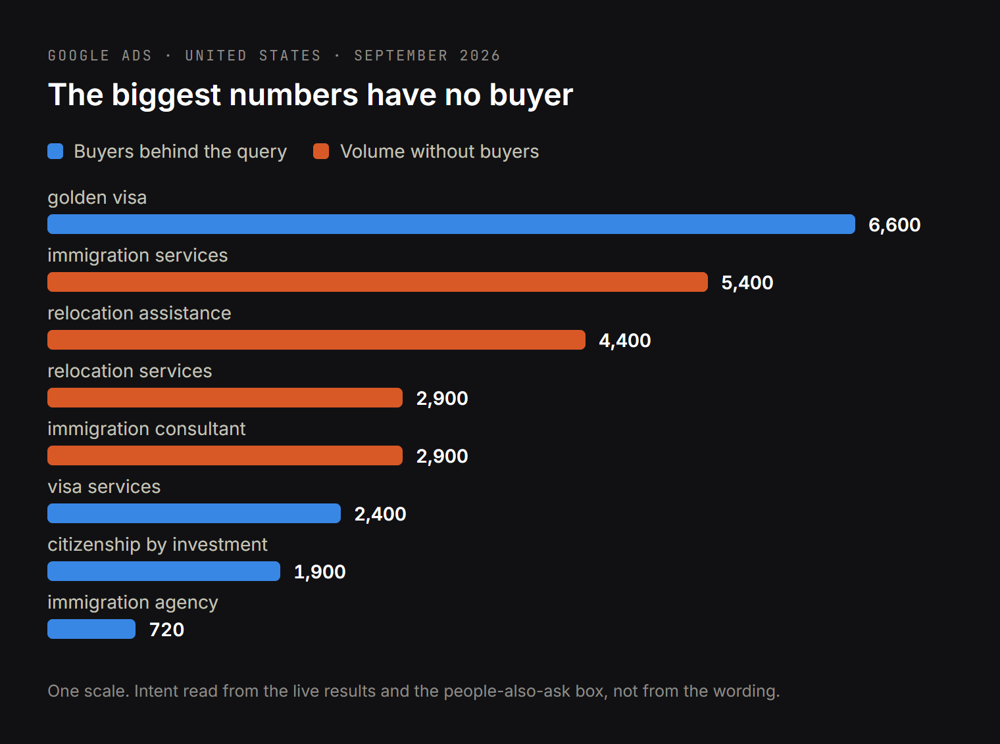
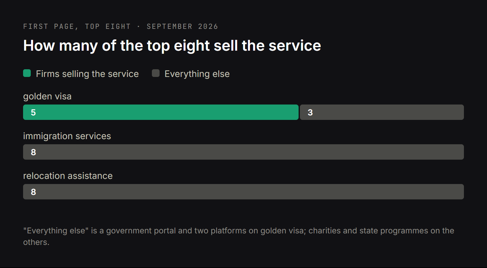

# DRAFT EN — not a translation. Its own spine: search volume misleads, intent decides.
# The real commercial niche in English is residency and citizenship by investment
# (golden visa 6,600/mo, AI answer on top, real competitors) — which is exactly
# moveandinvest's subject, so the link is evidence rather than an add-on.
# Data: research/dataforseo/relocation-topic.md + relocation-serp.json (2026-09-27).
# Cover: article-figures/cover-legalizacja-en.png (3344×1882). In-text figures:
#   fig-legalizacja-demand-en.png, fig-legalizacja-serp-en.png. Sources: the two i18n html files.
# Keywords in H2s: "golden visa" (2), "citizenship by investment" (2),
# "immigration consultant" (1), "relocation services" (1), "multilingual website" (1).
# Every number and domain comes from the measurement. Note: the SERP for
# "visa services" was NOT checked — its volume is quoted, its intent is not claimed.

Title: Immigration and relocation consultancies: which search queries actually bring clients
Slug: search-queries-that-bring-immigration-clients
Meta title: Which Search Queries Bring Immigration Consultancies Clients
Meta description: For residency, citizenship and visa advisory firms: golden visa gets 6,600 searches a month with buyers behind it, while the bigger numbers in the niche belong to charities and movers.

---

> Quick answer: in the US, "immigration services" gets 5,400 searches a month and "relocation assistance" 4,400 — and neither is a buying query. The first is dominated by charities and legal-aid nonprofits; the second by state subsidy programmes, with people asking "what states will pay you to relocate?". Meanwhile "golden visa" gets 6,600, "citizenship by investment" 1,900, and those results are held by real commercial firms — Henley & Partners, La Vida, Immigrant Invest — with an AI answer sitting above them. If you sell residency or citizenship advisory, the volume you should be chasing is a third the size of the headline numbers and worth many times more.

Most consultancies in this field pick their target keywords by looking at search volume. That is how a firm ends up writing an article about "immigration services", ranking nowhere, and concluding that SEO does not work in this industry. I made the same argument for law firms in [why every lawyer needs a website](https://www.bandziuk.com/blog/why-lawyer-needs-a-website).

What follows is a measurement taken on 27 September 2026: Google Ads volume for the queries in this niche, and the live results for the biggest of them, to see who holds each one and what the searcher actually wants.

## The biggest immigration search numbers are the wrong ones

Four queries with impressive volume, and what their results actually contain:

| Query | US volume | What the first page holds | Verdict |
| --- | --- | --- | --- |
| immigration services | 5 400 | legal-aid nonprofits and charities | free help, not a buyer |
| relocation assistance | 4 400 | state and county subsidy programmes | government money, not a buyer |
| relocation services | 2 900 | furniture movers | a different industry |
| immigration consultant | 2 900 | LinkedIn profiles, Reddit threads, salary pages | job seekers and salary research |

The "people also ask" boxes confirm it without ambiguity. For "immigration services": *Where can I get free immigration help?* For "relocation assistance": *What states will pay you to relocate?* and *How to get free money to move?* For "immigration consultant": *How much do you pay an immigration consultant?* alongside *How to become a certified immigration consultant?*

None of these is a person about to engage a paid advisory firm. A page written for them will attract exactly the traffic it deserves: people looking for something free, or for a job.

This is the single most useful thing in this article, and it costs nothing to apply. Before committing to a keyword, open the results and read who is there. Volume tells you how many people type the words. Only the results tell you what they want.

## "Golden visa" is the query with real commercial demand

The same measurement, filtered to queries where the first page is held by firms selling the service:

| Query | US volume | UK volume |
| --- | --- | --- |
| golden visa | 6 600 | 1 900 |
| citizenship by investment | 1 900 | 880 |
| visa services | 2 400 | 260 |
| immigration agency | 720 | 90 |
| visa consultant | 720 | 210 |
| residency by investment | 320 | 90 |
| relocation consultant | 140 | 50 |

"Golden visa" carries more volume than "immigration services" *and* a buyer behind it. The people-also-ask questions are about qualification and price — *Who qualifies for a golden visa?*, *How much money is required for a UAE Golden Visa?* — which is what someone asks when they are considering the transaction, not looking for charity.

One caveat I will state rather than paper over: I checked the live results for golden visa, immigration services, relocation services, relocation assistance and immigration consultant. I did not check "visa services", so its volume is here but its intent is not something I can vouch for. The same applies to the UK figures, which come from the volume data only.

## Who owns the golden visa results, and what that tells you

I checked the first page for "golden visa" in the US in September 2026 and counted who holds it.

**Five of the eight results are firms selling exactly this service** — the market leaders in residency and citizenship advisory, Henley & Partners at the top. That is the opposite of the "immigration services" page, where a commercial firm has no natural place at all.

Two observations worth acting on. Wikipedia and a Reddit thread hold two of the eight positions, which means the page is not saturated with well-optimised commercial content — there is room. And an **AI answer sits above all of it**, which changes what winning looks like.

## An AI answer above the results changes what a citizenship by investment page must do

When Google prints an answer above the links — as it does on "golden visa", on one of the three Polish queries I checked in the same niche and on both of the Russian ones — the contest stops being about a position in a list and becomes about **being the source that answer quotes**.

What gets quoted is what can be quoted: the minimum investment as a number, the processing time in months, the list of qualifying routes, the tax consequence in a sentence. Stated as text, in the opening lines, without a preamble.

This is where most advisory sites lose, and not for want of expertise. The expertise is there — it is just phrased as "every case is different, contact us for a consultation". That sentence cannot be quoted, so the answer above the results quotes a competitor who published the figure.

Two technical points decide whether your content is even readable by the crawlers behind those answers. Most of them do not execute JavaScript: an FAQ that loads its answers on click does not exist for them, and neither does a figure rendered inside an image. And structured data has to be in the server HTML, not injected after hydration. I write about this under [answer engine optimization](https://www.bandziuk.com/services/answer-engine-optimization-services), because it is now a larger share of the work than ranking is.

## A multilingual website is not a translated website

A residency-by-investment client is, by definition, not operating in their first country — and often not in their first language.

I measured the same niche in Russian, in Poland: "карта побыту" — a Russian transliteration of a Polish legal term — gets 2,400 searches a month, and all eight top results are private agencies with Russian-language content. Not one government site. A firm with an English-only site is invisible to that entire market while standing directly on its problem.

Doing this properly means more than a translation pass:

- **A separate URL per language**, not a switcher that swaps text at the same address. Search engines index addresses.
- **Keyword research per language.** A Russian-speaking, an Arabic-speaking and an English-speaking investor describe the same programme with different words, and a translation of your English page contains none of them.
- **Correct hreflang**, or your language versions compete with each other instead of covering more ground.
- **Enquiry forms in the language of the page.** Someone unsure of their English will not write into an English form.

The mechanics are in [multilingual website development](https://www.bandziuk.com/services/multilingual-website-development).

## What the firms holding the first page actually publish

Rather than theorise, I opened the sites holding those results.

**getgoldenvisa.com**, at position six on "golden visa", runs five language versions — English, Spanish, French, Portuguese and Turkish — and organises everything around the journey a buyer is on rather than around the firm. Henley & Partners at position one does the same at a larger scale, programme by programme and country by country.

The pattern is worth looking at outside this niche too, because it shows how far it goes. The site holding first place for the Russian-language query about Polish residence cards, karta-pobytu.pl, declares **sixteen language versions** in its markup: Polish, English, Russian, Ukrainian, Spanish, French, Portuguese, Turkish, Vietnamese, Tagalog, Armenian, Georgian, Swahili and two Chinese. Its navigation is one page per procedure — temporary residence, permanent residence, citizenship, work, irregular stay — not a single "services" page.

Set against the typical advisory site, the difference is not subtle:

| | Sites holding the first page | The typical advisory site |
| --- | --- | --- |
| Language versions | 5 to 16 | 1 |
| Pages per programme | one each | one "our services" list |
| Page for "golden visa" | yes | none |
| Page per country and route | yes | none |
| Thresholds and timelines | published as numbers | "contact us for details" |

With the right-hand column there is no page for Google to show against any of the queries in the tables above, which is the whole reason a firm with better casework loses to a firm with better architecture.

That difference is structural, not financial. Structure is something you can build.

## What a residency and citizenship advisory site actually needs

Specific to this niche, not general advice:

- **One page per programme and per country.** Portugal, UAE, Greece, Malta, Cyprus — each is its own query with its own volume. A single "our programmes" page competes for none of them.
- **Investment thresholds, timelines and total costs as numbers.** This is the whole game for AI answers, and it is also what separates a credible advisor from a brochure.
- **Sources for every figure.** Programme rules change by decree, sometimes with weeks of notice. A stated figure with a link to the statute or the official portal is what makes a page trustworthy to a reader and quotable to an assistant.
- **A visible last-updated date.** In a field where a programme can close, an undated page is a liability.
- **Proof you are a real firm.** Registration details, named people, jurisdictions you are licensed in. This niche has a fraud problem, and buyers know it.
- **Content for the stage before the enquiry.** Comparison tables, eligibility checks, cost calculators. Someone weighing five jurisdictions is months from signing, and whoever helps them compare is who they come back to.

## How this looks in practice: a residency-by-investment guide

So that this is not theory — I built a site on exactly this logic: [moveandinvest.com](https://www.moveandinvest.com), a multilingual guide to obtaining residency by investment across five jurisdictions.

The same rules as above: one address per programme and country, thresholds and timelines given as numbers rather than "ask a consultant", every figure attributed to its primary source, each language written from its own keyword research instead of translated. The full write-up, with the figures, is in [the case study for that project](https://www.bandziuk.com/portfolio/residency-by-investment-guide-with-sourced-figures).

## Common questions about SEO for immigration and relocation consultancies

**We get clients by referral. Why would we need search?**
A referral brings someone who has already chosen you. Search brings someone who does not yet know you exist, and that is the group that decides whether the firm grows. The two do not compete, but only one of them scales.

**How long before it works?**
For specific programme queries, first visits usually two to three months after publishing, meaningful volume after six. Anyone promising faster does not control the outcome.

**Can we compete with Henley & Partners?**
Not on "golden visa" as a single term, and you should not try. You can compete on the specific combinations they cover thinly: one programme, one nationality, one investment route, one tax question. That is where a firm with real casework has the advantage, because those pages need knowledge rather than budget.

**Is an AI answer above the results bad for us?**
It is bad for a page that says "contact us for details" and good for one that publishes the numbers. Which sources assistants actually cite, measured across 141 answers, is in [this study](https://www.bandziuk.com/blog/ai-assistant-recommendations-study). The answer needs a source, and it cites the page that answered concretely, not the biggest brand.

**Do we need every language?**
No — you need the languages of the passports you actually serve. Start by checking which nationalities your last fifty enquiries came from, then measure the volume in those languages before translating anything.

## Where to start

One thing you can do today without help: search "golden visa", then "immigration services", and compare the two first pages. One is your market. The other is a charity directory with a bigger number attached.

If the answer to "where do we rank" is "nowhere", that is not an advertising problem — it is the absence of pages that answer those queries. [Get in touch](https://www.bandziuk.com/contacts) and I will tell you which of the programmes you handle have real search demand behind them, and which do not deserve a page of their own.
