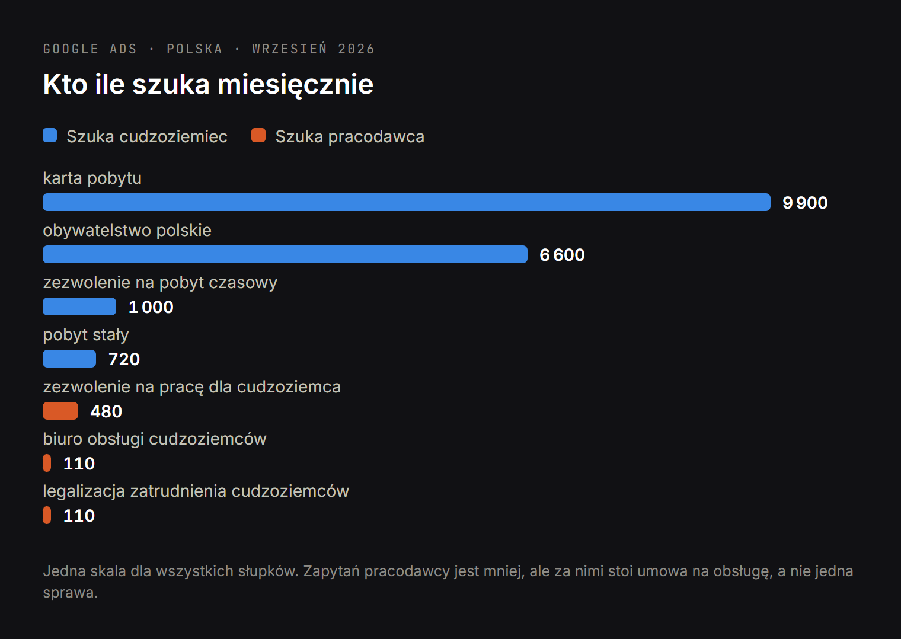
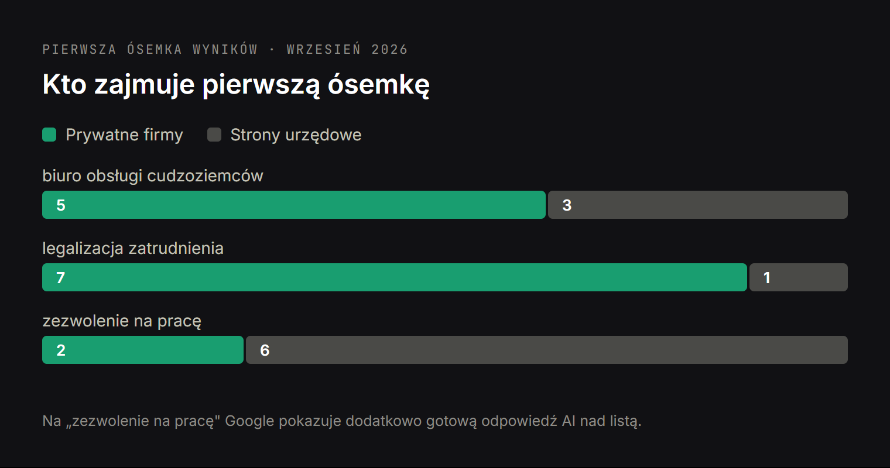

# DRAFT PL — статья для агентств по легализации и обслуживанию иностранцев.
# Данные: research/dataforseo/relocation-topic.md + relocation-serp.json (27.09.2026).
# Обложка: article-figures/cover-legalizacja-pl.png (3344×1882). Инфографики в тексте:
#   fig-legalizacja-demand-pl.png, fig-legalizacja-serp-pl.png. Исходники — два i18n-html рядом.
# Ключи в H2: «biuro obsługi cudzoziemców» (3), «legalizacja zatrudnienia cudzoziemców» (2),
# «zezwolenie na pracę dla cudzoziemca» (2), «karta pobytu» (2), «strona wielojęzyczna» (1).
# Все цифры и домены — из замера, ничего не выдумано.
# Ссылки: кейс moveandinvest + три услуги. Внешняя ссылка одна — на moveandinvest.com.

Title: Strona biura obsługi cudzoziemców: dlaczego klienci trafiają do konkurencji
Slug: strona-biura-obslugi-cudzoziemcow
Meta title: Strona biura obsługi cudzoziemców: skąd brać klientów
Meta description: Poradnik dla biur legalizacji pobytu i agencji relokacyjnych: 9 900 zapytań o kartę pobytu i 480 o zezwolenie na pracę dla cudzoziemca miesięcznie. Kto je dziś zbiera i czego brakuje na waszej stronie.

---

> Szybka odpowiedź: w Polsce co miesiąc 9 900 osób szuka frazy „karta pobytu", 480 pracodawców szuka „zezwolenia na pracę dla cudzoziemca", a 110 osób wpisuje wprost „biuro obsługi cudzoziemców". Pierwsze miejsce na to ostatnie zapytanie zajmuje prywatna agencja, nie urząd. Stronę, która zajmuje pierwsze miejsce na rosyjskojęzyczne zapytanie o kartę pobytu, zbudowano w szesnastu wersjach językowych i z osobną stroną na każdą procedurę. To różnica w strukturze, nie w budżecie reklamowym.

Większość biur legalizacyjnych w Polsce działa z polecenia. To działa — dopóki polecenia wystarczają. Problem pojawia się wtedy, gdy trzeba rosnąć szybciej, niż rośnie liczba zadowolonych klientów, albo gdy jeden duży kontrakt korporacyjny się kończy i trzeba szybko zapełnić lukę.

Ten tekst nie jest o tym, że „każda firma potrzebuje strony" — [taki poradnik napisałem osobno dla kancelarii prawnych](https://www.bandziuk.com/pl/blog/dlaczego-prawnikowi-potrzebna-strona-www). Jest o konkretnych liczbach z Google Ads i o tym, kto dziś zbiera te zapytania.

## Ile osób szuka legalizacji pobytu i zatrudnienia cudzoziemców

Dane z Google Ads dla Polski, wrzesień 2026, średnia miesięczna liczba wyszukiwań:

| Zapytanie | Miesięcznie | Kto tego szuka |
| --- | --- | --- |
| karta pobytu | 9 900 | cudzoziemiec |
| obywatelstwo polskie | 6 600 | cudzoziemiec |
| zezwolenie na pobyt czasowy | 1 000 | cudzoziemiec |
| pobyt stały | 720 | cudzoziemiec |
| zezwolenie na pracę dla cudzoziemca | 480 | **pracodawca** |
| karta pobytu warszawa | 390 | cudzoziemiec |
| legalizacja pobytu | 260 | cudzoziemiec |
| biuro obsługi cudzoziemców | 110 | pracodawca lub cudzoziemiec szukający pośrednika |
| legalizacja zatrudnienia cudzoziemców | 110 | **pracodawca** |
| obsługa cudzoziemców | 50 | pracodawca |
| pomoc w uzyskaniu karty pobytu | 50 | cudzoziemiec |
| biuro imigracyjne | 40 | cudzoziemiec |

Do tego ten sam rynek po rosyjsku, w Polsce: „карта побыту" 2 400 zapytań miesięcznie, „легализация в польше" 260, „разрешение на работу в польше" 140. To ci sami ludzie, tylko wpisujący zapytanie w swoim języku.

Razem, licząc ostrożnie i tylko frazy z tabeli, to kilkanaście tysięcy wyszukiwań miesięcznie w jednym kraju. Każde z nich to ktoś, kto ma problem, który wy rozwiązujecie zawodowo.

## Kto zajmuje pierwszą stronę na „biuro obsługi cudzoziemców"

Tu zaczyna się część, której nie widać z własnego biura. Sprawdziłem wyniki wyszukiwania dla tego zapytania (Polska, wrzesień 2026) i policzyłem, kto je zajmuje.

**Pięć z ośmiu pierwszych miejsc należy do prywatnych firm robiących dokładnie to, co wy.** Pozostałe trzy to strony urzędowe: gov.pl i dwa urzędy wojewódzkie. Pierwsze miejsce — prywatna agencja, nie urząd.

I nie są to kancelarie z dużym budżetem reklamowym. To biura tej samej wielkości co wasze, które po prostu mają stronę odpowiadającą na to zapytanie.

To jest najważniejszy wniosek z całego tekstu. Na tym zapytaniu nie konkurujecie z państwem. Konkurujecie z konkurentem z tej samej ulicy, który zajął miejsce, bo je zajął pierwszy.

## „Zezwolenie na pracę dla cudzoziemca" to zapytanie pracodawcy, nie cudzoziemca

Na tę różnicę warto patrzeć uważnie, bo od niej zależy wartość klienta.

Kiedy cudzoziemiec szuka „karty pobytu", to jedna sprawa, jeden klient, jedna płatność. Kiedy polski pracodawca szuka „zezwolenia na pracę dla cudzoziemca" (480 miesięcznie) albo „legalizacji zatrudnienia cudzoziemców" (110 miesięcznie), to potencjalnie kilkudziesięciu pracowników, umowa na obsługę i stała współpraca.

Przy zapytaniu „legalizacja zatrudnienia cudzoziemców" układ jest wręcz zapraszający: pierwsze miejsce zajmuje rządowy biznes.gov.pl, a **wszystkie pozostałe siedem miejsc w pierwszej ósemce należy do firm prywatnych** — kancelarii, firm szkoleniowych i agencji obsługi cudzoziemców. Jedno miejsce dla państwa, siedem do wzięcia.

Przy „zezwoleniu na pracę dla cudzoziemca" urzędy trzymają się mocniej: pięć pierwszych pozycji to portale rządowe i urzędy wojewódzkie. Ale na siódmym i ósmym miejscu są już firmy prywatne. Da się tu wejść, po prostu niżej — i przy 480 zapytaniach miesięcznie siódme miejsce też ma wartość.

## Odpowiedź AI nad wynikami zmienia zasady dla biur imigracyjnych

Z trzech sprawdzonych zapytań po polsku gotową odpowiedź AI nad listą wyników Google pokazuje na jednym — „zezwolenie na pracę dla cudzoziemca", czyli akurat na tym najbardziej wartościowym, zadawanym przez pracodawcę. Po rosyjsku: na obu sprawdzonych — „карта побыту" i „легализация в Польше".

Co to znaczy w praktyce: użytkownik dostaje odpowiedź, zanim dojdzie do linków. Walka o miejsce na liście zmienia się w walkę o to, **żeby być źródłem, które ta odpowiedź cytuje**. A cytowane jest to, co da się zacytować: konkretna liczba dni oczekiwania, lista wymaganych dokumentów, kwota opłaty — podana tekstem, w pierwszym akapicie, bez owijania.

Jest w tym dobra wiadomość dla małego biura. Odpowiedź AI cytuje stronę, która odpowiada najkonkretniej, niekoniecznie największą. Wasza wiedza operacyjna — ile realnie czeka się teraz na kartę pobytu w waszym urzędzie wojewódzkim, czego naprawdę brakuje w odrzucanych wnioskach — jest dokładnie tym rodzajem treści, którego nie ma na stronie urzędu. Co trzeba zrobić technicznie, żeby te treści w ogóle trafiły do odpowiedzi, opisuję w [przygotowaniu strony do wyszukiwania AI](https://www.bandziuk.com/pl/oferty/przygotowanie-strony-do-wyszukiwania-ai).

## Klient szuka po ukraińsku i rosyjsku, a strona wielojęzyczna to nie tłumaczenie

Tu jest najczęstszy błąd w tej branży, i kosztowny.

Wasz klient to z definicji ktoś, kto nie mówi po polsku na tyle swobodnie, żeby wpisywać polskie terminy prawne. Dlatego „карта побыту" ma w Polsce 2 400 wyszukiwań miesięcznie — to zapytanie zadane w Polsce, po rosyjsku, o polską procedurę. Strona istniejąca tylko po polsku jest dla tej osoby niewidoczna, choć stoi dokładnie na jej problemie.

I zobaczcie, kto te 2 400 zapytań zbiera: **siedem z ośmiu pierwszych miejsc to prywatne firmy z treścią po rosyjsku**. Ani jednego urzędu w pierwszej ósemce. Zapytanie zadane w Polsce, o polską procedurę, a wszystkie odpowiedzi po rosyjsku — bo tak je zadano.

Strona wielojęzyczna zrobiona dobrze to nie przetłumaczony polski tekst. To osobny adres dla każdego języka, własne słowa kluczowe w tym języku (bo Ukrainiec szuka inaczej niż Polak), poprawne znaczniki hreflang, żeby Google wiedział, komu pokazać którą wersję, i formularz w języku, w którym klient jest gotów napisać. [Tworzenie stron wielojęzycznych](https://www.bandziuk.com/pl/oferty/tworzenie-stron-wielojezycznych) opisuję osobno, bo to najczęstsza przyczyna utraconych zapytań w tej branży.

## Co ma strona konkurenta z pierwszego miejsca, czego nie ma wasza

Zamiast teoretyzować, otworzyłem stronę, która zajmuje pierwsze miejsce na zapytanie „карта побыту" — czyli zbiera te 2 400 wyszukiwań miesięcznie od waszych klientów. To karta-pobytu.pl.

Dwie rzeczy w jej budowie tłumaczą pierwsze miejsce lepiej niż jakikolwiek budżet reklamowy.

**Szesnaście wersji językowych.** W kodzie strony zadeklarowane są: polska, angielska, rosyjska, ukraińska, hiszpańska, francuska, portugalska, turecka, wietnamska, tagalska, ormiańska, gruzińska, suahili i dwie chińskie. Nie tłumaczenie „na wszelki wypadek" — każda z nich istnieje, bo ktoś policzył, z jakich krajów przyjeżdżają klienci.

**Osobna strona na każdą procedurę.** W nawigacji: pobyt czasowy, pobyt stały, obywatelstwo, praca, pobyt nielegalny. Każda z własnym adresem, bo każda jest w Google osobnym zapytaniem z osobnym popytem.

Porównanie z typową stroną biura legalizacyjnego wygląda tak:

| | Strona z pierwszego miejsca | Typowa strona biura |
| --- | --- | --- |
| Wersje językowe | 16 | 1 (polska) |
| Strony na procedury | osobna na każdą | jedna „Usługi" z listą |
| Adres dla zapytania „karta pobytu" | tak | brak |
| Adres dla zapytania pracodawcy | tak | brak |
| Terminy i koszty | podane liczbami | „wycena indywidualna" |

Przy prawej kolumnie nie da się zająć miejsca na żadne z zapytań z tabeli powyżej — nie ma strony, którą Google mógłby na nie pokazać.

Dobra wiadomość: to różnica w strukturze, nie w budżecie. Struktura jest do zrobienia.

## Co powinna zawierać strona biura obsługi cudzoziemców

Bez ogólników. Konkretnie to, czego brakuje na stronach, które w tej branży widziałem:

- **Osobna strona na każdą procedurę**, nie jedna lista usług. Karta pobytu czasowego, pobyt stały, zezwolenie na pracę, obywatelstwo, legalizacja zatrudnienia w firmie — każda z własnym adresem, bo każda jest osobnym zapytaniem w Google.
- **Osobna sekcja dla pracodawców.** To inny klient niż cudzoziemiec, inny budżet i inne pytania. Na jednej stronie z ofertą dla osób prywatnych przepada.
- **Terminy i koszty podane liczbami.** „Skontaktuj się, wycenimy" na stronie usługowej oznacza, że w odpowiedzi AI zacytowana zostanie strona konkurenta, która podała kwotę.
- **Lista dokumentów do pobrania** dla każdej procedury. To treść, która przyciąga ludzi na etapie, gdy jeszcze próbują zrobić to sami — i wracają, gdy się okaże, że nie chcą.
- **Wersje językowe: ukraińska i rosyjska, przynajmniej.** Patrz wyżej: 2 400 wyszukiwań miesięcznie po rosyjsku w samej Polsce.
- **Dowody, że jesteście prawdziwą firmą.** To branża, w której klient boi się oszustwa: NIP, adres, zdjęcia zespołu, opinie Google. W żadnej innej niszy ten element nie działa tak mocno.
- **Aktualna data przy treściach o przepisach.** Przepisy dotyczące zatrudniania cudzoziemców zmieniły się w 2025 i zmieniają dalej. Strona z nieaktualnym stanem prawnym traci zaufanie natychmiast i u klienta, i w wyszukiwarce.

## Jak to wygląda w praktyce: przewodnik po rezydencji za inwestycje

Żeby to nie było teorią — zbudowałem stronę dokładnie na tej logice, tylko dla wyższego segmentu tego samego rynku: [moveandinvest.com](https://www.moveandinvest.com) to wielojęzyczny przewodnik po uzyskaniu rezydencji za inwestycje w pięciu jurysdykcjach.

Zasada była ta sama, co opisałem wyżej: każda procedura i każdy kraj na własnym adresie, kwoty i terminy podane liczbami zamiast „zapytaj o ofertę", każdy język pisany od zera pod własne zapytania, a nie tłumaczony, wszystkie dane z podaniem źródła. Pełny opis z liczbami jest w [studium przypadku tego projektu](https://www.bandziuk.com/pl/portfolio/przewodnik-po-rezydencji-za-inwestycje-ze-zrodlami).

To ten sam schemat, który zadziała na „kartę pobytu" i „legalizację zatrudnienia cudzoziemców". Zmieniają się procedury i języki, nie zasada.

## Najczęstsze pytania o stronę dla biura imigracyjnego

**Mamy klientów z polecenia, po co nam strona?**
Polecenie przynosi klienta, który już was wybrał. Wyszukiwarka przynosi tego, który jeszcze nie wie, że istniejecie — i to on decyduje, czy firma rośnie. Te dwa kanały się nie wykluczają, ale tylko jeden jest skalowalny.

**Ile to trwa, zanim zacznie działać?**
Na zapytania o konkretne procedury pierwsze wejścia zwykle po dwóch–trzech miesiącach od publikacji treści, sensowny ruch po sześciu. Nikt, kto obiecuje szybciej, tego nie kontroluje.

**Czy wystarczy profil w Google i Facebook?**
[Profil w Google i pozycjonowanie lokalne](https://www.bandziuk.com/pl/oferty/pozycjonowanie-lokalne) są konieczne i działają na zapytania z nazwą miasta. Ale nie zajmie miejsca na „legalizację zatrudnienia cudzoziemców", bo to nie zapytanie lokalne, i nie zostanie zacytowany w odpowiedzi AI jako źródło procedury. Do tego potrzebne są strony z treścią.

**Czy da się zrobić tylko wersję ukraińską i rosyjską, bez polskiej?**
Nie warto. Zapytania pracodawców — te najbardziej wartościowe — są po polsku. Wersja polska sprzedaje firmom, wersje ukraińska i rosyjska sprzedają osobom prywatnym. To dwa różne rynki na jednej stronie.

**Co jeśli przepisy się zmienią i treść się zestarzeje?**
Dlatego treść o procedurach trzyma się w systemie zarządzania, w którym wasz zespół sam zmienia liczby i terminy, bez programisty. To warunek, nie dodatek — patrz [utrzymanie strony internetowej](https://www.bandziuk.com/pl/oferty/utrzymanie-strony-internetowej).

## Od czego zacząć

Jedna rzecz na początek, do zrobienia bez niczyjej pomocy: wpiszcie w Google „biuro obsługi cudzoziemców" i „legalizacja zatrudnienia cudzoziemców", i sprawdźcie, ilu z pierwszej dziesiątki znacie osobiście. Potem policzcie, na którym miejscu jesteście wy.

Jeśli odpowiedź jest „nigdzie", to nie problem reklamy, tylko brak stron, które odpowiadają na te zapytania. [Napiszcie do mnie](https://www.bandziuk.com/pl/kontakt) — powiem, które procedury z waszej oferty mają realny popyt w wyszukiwarce, a które nie warte są osobnej strony.
