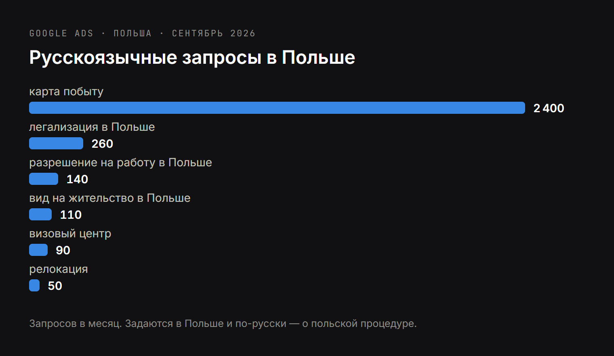
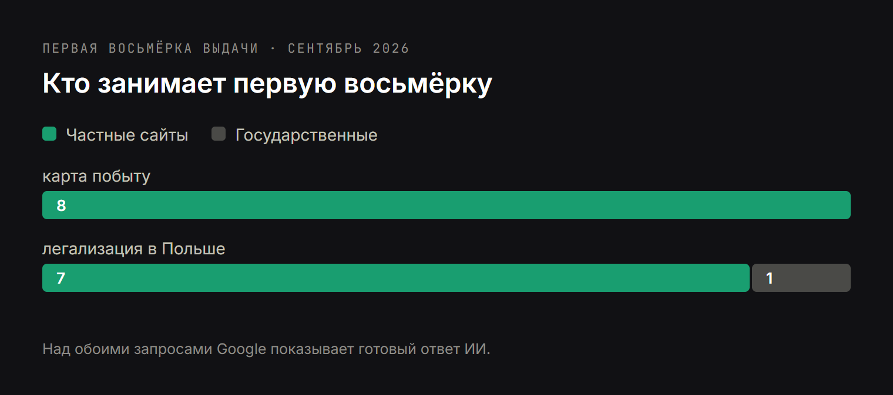

# DRAFT RU — не перевод польской версии. Своя опора: клиент ищет из своей страны,
# до переезда, по-русски; 2 400 запросов «карта побыту» в Польше заняты частными
# агентствами целиком, включая домен-точное-совпадение на первом месте.
# Данные: research/dataforseo/relocation-topic.md + relocation-serp.json (27.09.2026).
# Обложка: article-figures/cover-legalizacja-ru.png (3344×1882). Инфографики в тексте:
#   fig-legalizacja-demand-ru.png, fig-legalizacja-serp-ru.png. Исходники — два i18n-html рядом.
# Ключи в H2: «карта побыту» (3), «легализация в Польше» (2), «разрешение на работу» (1),
# «многоязычный сайт» (1), «ответ ИИ» (1).
# Фамилия — Бандюк. Слово «частный» о себе не использовать. Яндекс не упоминать.

Title: Сайт агентства по легализации: почему клиенты уходят к конкурентам
Slug: sait-agentstva-po-legalizacii
Meta title: Сайт агентства по легализации: как получать клиентов из поиска
Meta description: Для агентств по легализации и релокации: 2 400 запросов «карта побыту» в месяц в Польше собирают конкуренты, а не ведомства. Разбор выдачи и чего не хватает вашему сайту.

---

> Короткий ответ: запрос «карта побыту» задают в Польше 2 400 раз в месяц — по-русски, о польской процедуре. Семь из восьми первых мест заняты частными агентствами и юридическими компаниями — ни одного государственного сайта в первой восьмёрке нет. Над результатами при этом стоит готовый ответ ИИ. Ваш клиент ищет не по-польски и часто ещё до переезда — а сайт, если он есть, обычно только по-польски и только о компании.

Агентства по релокации и легализации почти всегда растут на сарафане. Это нормально и это работает — до момента, когда нужно вырасти быстрее, чем растёт число довольных клиентов, или когда один корпоративный контракт заканчивается и его надо чем-то закрыть.

Ниже — не рассуждение о пользе сайта, а цифры замера от 27 сентября 2026 года и разбор выдачи по запросам ваших клиентов. Как устроены сами ответы ИИ и кого они цитируют, я разбирал отдельно в [исследовании ответов ИИ-ассистентов](https://www.bandziuk.com/ru/blog/issledovanie-otvetov-ii-assistentov).

## «Карта побыту» — 2 400 запросов в месяц, и все они не по-польски

Данные Google Ads, русский язык, территория Польши:

| Запрос | В месяц |
| --- | --- |
| карта побыту | 2 400 |
| легализация в Польше | 260 |
| разрешение на работу в Польше | 140 |
| вид на жительство в Польше | 110 |
| визовый центр | 90 |
| релокация | 50 |
| гражданство за инвестиции | 30 |
| помощь с картой побыту | 20 |
| миграционный юрист | 20 |
| оформление карты побыту | 10 |

Обратите внимание на первую строку и на то, где эти запросы задаются. Человек находится в Польше или собирается туда, процедура польская, а формулировка — русская транслитерация польского термина: «карта побыту», а не «karta pobytu». Для сайта, у которого есть только польская версия, этот человек не существует.

Отдельно: в Казахстане «визовый центр» ищут 480 раз в месяц, «релокация» — 210. Это спрос из страны выезда, то есть человек начинает искать исполнителя ещё до переезда, когда выбирать ему проще всего и когда он готов платить за то, чтобы не разбираться самому.

## Кто занимает выдачу по запросу «карта побыту»

Проверил живую выдачу (Польша, русский язык, сентябрь 2026) и посчитал, кому принадлежат места.

**Семь из восьми первых мест — частные агентства и юридические компании.** Восьмое у частного вуза. Государственных сайтов в первой восьмёрке нет вообще: по этому запросу человек ищет не закон, а исполнителя, и Google это понимает.

Отдельно стоит посмотреть на первое место. Его занимает сайт на домене, который буквально повторяет запрос — karta-pobytu.pl. Кто-то в этой нише сел и подумал, что именно вводят его клиенты, ещё на этапе выбора домена. Остальные семь мест выиграны не бюджетом, а тем, что там есть страница, отвечающая на запрос.

По запросу «легализация в Польше» картина почти такая же: одно место у воеводского управления, **остальные семь — у частных сайтов**, причём у нескольких с русскоязычным контентом.

## Ответ ИИ стоит над выдачей и по «карте побыту», и по «легализации в Польше»

И по «карте побыту», и по «легализации в Польше» Google показывает готовый ответ ИИ выше списка ссылок.

Что это меняет. Человек получает ответ до того, как дойдёт до ссылок, и борьба за место в списке превращается в борьбу за то, **чтобы быть источником, который этот ответ цитирует**. Цитируется же то, что можно процитировать: срок ожидания в днях, перечень документов, размер пошлины — текстом, в первом же абзаце, без подводки.

Для небольшого агентства это скорее хорошая новость. Ответ ИИ ссылается на страницу, которая отвечает конкретнее, а не на самую крупную. Ваше операционное знание — сколько реально сейчас ждут карту побыту в конкретном воеводском управлении, из-за чего чаще всего отказывают — как раз то, чего нет ни на сайте ведомства, ни у конкурента, который написал «оставьте заявку, мы всё расскажем».

Отдельно замечу: большинство сборщиков, которые формируют ответы ассистентов, не выполняют JavaScript. Если у вас ответы на вопросы открываются по клику и подгружаются скриптом, для них этого текста на странице нет. Об этом — [подготовка сайта к ИИ-поиску](https://www.bandziuk.com/ru/uslugi/podgotovka-saita-k-ii-poisku).

## Многоязычный сайт — это не перевод польской версии

Здесь самая частая и самая дорогая ошибка в этой нише.

Ваш клиент по определению не владеет польским настолько, чтобы вводить польские юридические термины. Поэтому запрос звучит как «карта побыту», «легализация в Польше», «разрешение на работу в Польше» — на его языке, о чужой процедуре. Сайт, существующий только по-польски, для него невидим, даже если он стоит ровно на его проблеме.

Что значит «многоязычный» на деле:

- **Отдельный адрес под каждый язык**, а не переключатель, подменяющий текст на том же адресе. Google индексирует адреса, не состояния страницы.
- **Свои ключевые слова в каждом языке.** Украинец, русскоязычный клиент и поляк ищут одно и то же разными словами, и перевод польской страницы эти слова не содержит по определению.
- **Корректные hreflang**, чтобы поисковая система понимала, какую версию кому показывать, иначе версии начинают вытеснять друг друга.
- **Форма заявки на языке страницы.** Человек, который не уверен в своём польском, не станет писать в польскую форму — он закроет вкладку и вернётся к конкуренту.

Как это устроено технически, я расписал в услуге [разработка многоязычного сайта](https://www.bandziuk.com/ru/uslugi/razrabotka-multiyazychnogo-saita).

## Что есть у сайта с первого места, чего нет у вашего

Вместо рассуждений я открыл сайт, который занимает первое место по запросу «карта побыту», то есть собирает те самые 2 400 обращений в месяц. Это karta-pobytu.pl.

Две вещи в его устройстве объясняют первое место лучше любого рекламного бюджета.

**Шестнадцать языковых версий.** В коде страницы объявлены польская, английская, русская, украинская, испанская, французская, португальская, турецкая, вьетнамская, тагальская, армянская, грузинская, суахили и две китайских. Это не перевод «на всякий случай» — каждая существует потому, что кто-то посчитал, из каких стран приезжают клиенты.

**Отдельная страница на каждую процедуру.** В навигации: временное пребывание, постоянное пребывание, гражданство, работа, нелегальное пребывание. У каждой свой адрес, потому что каждая — отдельный запрос с отдельным спросом.

Сравнение с типичным сайтом агентства по легализации:

| | Сайт с первого места | Типичный сайт агентства |
| --- | --- | --- |
| Языковых версий | 16 | 1 |
| Страниц под процедуры | своя на каждую | одна «Услуги» списком |
| Адрес под запрос «карта побыту» | есть | нет |
| Адрес под запрос работодателя | есть | нет |
| Сроки и цены | числами | «расчёт индивидуально» |

При правой колонке занять место ни по одному запросу из таблицы выше невозможно: Google нечего показать в ответ.

Хорошая новость в том, что это разница в структуре, а не в деньгах. Структуру можно построить.

## Что должно быть на сайте агентства по легализации

Без общих слов — то, чего обычно не хватает на сайтах этой нишы:

- **Отдельная страница на каждую процедуру.** Карта побыту на год, постоянное пребывание, разрешение на работу, гражданство, легализация трудоустройства для компании — каждая со своим адресом, потому что каждая является отдельным запросом.
- **Отдельный раздел для работодателей.** Это другой клиент, другой чек и другие вопросы, и на общей странице услуг он теряется. По-польски таких запросов заметно больше: «zezwolenie na pracę dla cudzoziemca» — 480 в месяц.
- **Сроки и цены числами.** «Стоимость по запросу» на странице услуги означает, что в ответе ИИ процитируют конкурента, который цифру назвал.
- **Списки документов для скачивания** по каждой процедуре. Это то, что приводит человека на этапе, когда он ещё пробует сделать всё сам, — и возвращает, когда выясняется, что не хочет.
- **Доказательства, что вы настоящая компания.** Ниша, в которой клиент боится обмана: регистрационные данные, адрес, фотографии команды, отзывы в Google. Ни в одной другой нише этот блок не влияет на заявки так сильно.
- **Дата актуальности у всего, что касается правил.** Правила трудоустройства иностранцев в Польше менялись в 2025-м и продолжают меняться. Устаревшая страница теряет доверие мгновенно — и у клиента, и в поиске.

## Как это выглядит на практике: справочник по ВНЖ за инвестиции

Чтобы это не осталось теорией: я построил сайт ровно по этой логике, только для верхнего сегмента того же рынка — [moveandinvest.com](https://www.moveandinvest.com/ru), многоязычный справочник по получению вида на жительство за инвестиции в пяти юрисдикциях.

Принцип тот же, что описан выше: каждая процедура и каждая страна на своём адресе, суммы и сроки числами вместо «узнайте у консультанта», каждый язык написан отдельно под свои запросы, а не переведён, все данные с указанием первоисточника. Подробный разбор с цифрами — в [кейсе этого проекта](https://www.bandziuk.com/ru/portfolio/spravochnik-po-vnzh-za-investicii-s-pervoistochnikami).

Та же схема работает и на «карту побыту», и на «легализацию в Польше». Меняются процедуры и языки, принцип не меняется.

## Частые вопросы о сайте для агентства по релокации

**У нас клиенты по рекомендациям, зачем нам сайт?**
Рекомендация приводит того, кто вас уже выбрал. Поиск приводит того, кто ещё не знает, что вы существуете, — и именно он определяет, растёт компания или держится на месте. Каналы не конкурируют, но масштабируется только один.

**Сколько ждать результата?**
По запросам о конкретных процедурах первые переходы обычно через два-три месяца после публикации, осмысленный поток — через полгода. Кто обещает быстрее, тот этим не управляет.

**Хватит ли профиля в Google и соцсетей?**
[Профиль в Google и локальное продвижение](https://www.bandziuk.com/ru/uslugi/lokalnoe-seo-prodvizhenie) обязательны и работают на запросы с названием города. Но он не займёт место по «карте побыту» — это не локальный запрос — и не будет процитирован в ответе ИИ как источник процедуры. Для этого нужны страницы с текстом.

**Мы работаем по всей Польше, а не в одном городе. Это мешает?**
Наоборот, помогает: процедурные запросы вроде «карта побыту» не привязаны к городу, и по ним борьба идёт содержанием, а не адресом офиса. Городские запросы («карта побыту Варшава», 390 в месяц по-польски) стоит добирать отдельными страницами.

**Нужны ли украинская и польская версии, если клиенты русскоязычные?**
Польская — да, если вы хотите работодателей: их запросы по-польски. Украинская — по составу вашей клиентской базы, но по объёму обращений в Польше это сейчас крупнейшая группа.

## С чего начать

Одно действие, которое можно сделать прямо сейчас и без чьей-либо помощи: введите в Google «карта побыту» и «легализация в Польше» и посмотрите, сколько компаний из первой десятки вы знаете лично. Потом посчитайте, на каком месте вы.

Если ответа «нигде» — это не проблема рекламы, а отсутствие страниц, которые отвечают на эти запросы. [Напишите мне](https://www.bandziuk.com/ru/kontakty), и я скажу, по каким процедурам из вашего набора есть реальный спрос в поиске, а по каким отдельную страницу делать не стоит.
